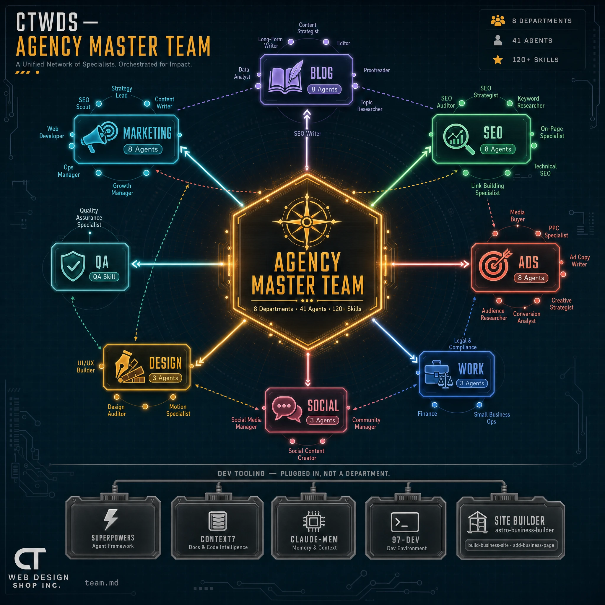

# CTWDS Team — Claude Company OS

This folder is CT Web Design Shop's AI agency: an installer that pulls in third-party Claude Code skill plugins, plus a set of operational playbooks that turn those skills into 8 coordinated "departments" of AI agents.

There are two layers here and they're not the same thing:

1. **The installer** (`install-claude-company-os.sh`) installs **skill plugins** — the actual Claude Code capabilities (commands like `/seo audit`, `/ads plan`, `impeccable:polish`, etc.).
2. **The team docs** (everything else in this folder) describe **how to use those skills like a staffed department** — who owns what, what runs daily vs. weekly, and how departments hand work off to each other.

Skills are the tools. Team docs are the org chart and the operating manual for those tools.

---

## Tutorial Video

<a href="https://www.loom.com/share/8cec334ee1b14439b61ef169608d6ddf" target="_blank" rel="noopener noreferrer">Watch the walkthrough on Loom</a>

---

## Install

Run the installer once per machine (skills install to `~/.claude/skills` and plugins install globally, not per-project):

```bash
bash ctwds-team/install-claude-company-os.sh
```

### Options

```bash
# Preview what would run without installing anything
bash ctwds-team/install-claude-company-os.sh --dry-run

# Install only specific groups
bash ctwds-team/install-claude-company-os.sh --only dev,design

# Install everything except specific groups
bash ctwds-team/install-claude-company-os.sh --skip dev
```

### Groups

| Group | What it installs | Source |
| ----- | ----------------- | ------ |
| `work` | Small business, legal, finance plugins | `anthropics/knowledge-work-plugins` |
| `marketing` | 34 marketing skills | `coreyhaines31/marketingskills` |
| `social` | Social media skills (voice-builder, per-platform content, analytics) | `charlie947/social-media-skills` |
| `dev` | Superpowers, Context7, Claude-Mem, 97-dev | various marketplaces |
| `design` | UI UX Pro Max, Impeccable, Taste, Transitions.dev | various marketplaces |

All groups run by default. `dev` and `design` also trigger a copy of 4 example skills from `anthropics/skills` (`skill-creator`, `mcp-builder`, `web-artifacts-builder`, `brand-guidelines`).

### Requirements

- `claude` CLI on `PATH`
- `git`
- Node 22.12+ and `npx` — needed for Impeccable, Taste, and Transitions.dev (the `design` group). Without Node, the installer skips those three and warns instead of failing.

### After installing

1. Restart Claude Code so new plugins load.
2. Run `/plugin` to confirm everything shows up.
3. If you installed `dev`: run `npx claude-mem install` to start the Claude-Mem worker.
4. If you installed `social`: run voice-builder first — every other social skill reads its output. Set `APIFY_API_TOKEN` and `GOOGLE_AI_API_KEY` for `post-scorer` and `reels-scripting`.
5. If you installed `design`: run `/impeccable init` once per project (from the repo root — it reads existing tokens/components instead of overwriting them). Impeccable and Taste both install and overlap on the same job (steering/polishing frontend design) — try both, then drop whichever you don't reach for. Neither uninstall damages project files.

The installer is safe to re-run — it treats "already installed" as success, not failure, and only exits non-zero on a real failure.

---

## Folder structure

```text
ctwds-team/
├── README.md                     ← this file
├── install-claude-company-os.sh  ← installs the underlying skill plugins
├── agency-master-team.md         ← top-level orchestration: all 8 departments, cadences, cross-team playbooks
│
├── marketing-skills.md           ← flat skill/command reference
├── ai-marketing-team.md          ← 8 agents built on those skills: daily/weekly tasks, outputs, handoffs
│
├── blog-skills.md
├── ai-blog-team.md
│
├── seo-skills.md
├── ai-seo-team.md
│
├── ads-skills.md
├── ai-ads-team.md
│
├── work-skills.md
├── ai-work-team.md
│
├── social-skills.md
├── ai-social-team.md
│
├── design-skills.md
├── ai-design-team.md
│
├── qa-skills.md                  ← `/qa-personas` persona-based site testing (no team doc — single skill)
├── post-launch-team.md           ← one-shot post-launch checklist playbook (not an ongoing department)
└── site-builder-skills.md        ← `astro-business-builder` plugin — dev tooling, no team doc (see note below)
```

Every department follows the same two-file pattern: `<name>-skills.md` is the reference list of raw skill/command names; `ai-<name>-team.md` is the operational playbook built on top of it. `agency-master-team.md` is the only file that ties all departments together.

---

## How it works

### The 8 departments

| Department | Agents | Built on |
| ---------- | ------ | -------- |
| Marketing | 8 | `coreyhaines31/marketingskills` |
| Blog | 8 | `/blog` content engine |
| SEO | 8 | `/seo` engine |
| Ads | 8 | `/ads` engine |
| Work | 3 | `anthropics/knowledge-work-plugins` |
| Social | 3 | `charlie947/social-media-skills` |
| Design | 3 | `ui-ux-pro-max`, `impeccable`, `taste`, `transitions.dev` |
| QA | — | `/qa-personas` |

`dev` (Superpowers, Context7, Claude-Mem, 97-dev) is infrastructure — debugging discipline, doc lookup, session memory — not a client-facing department, so it has no team doc.

`astro-business-builder` (site scaffolding, `cliftonc0613/astro-business-builder` — installed separately, not part of `install-claude-company-os.sh`) is grouped alongside `dev` for the same reason: it's a capability invoked directly for a task, not a department with agents, cadence, or handoffs. Reference: `site-builder-skills.md`.

### Reading one team doc

Each `ai-<name>-team.md` breaks its department into agents. Every agent section has the same shape:

- **Specialty** and **Skills** — what this agent owns and which commands it runs
- **Daily Tasks** — a table of small checks run every morning
- **Weekly Tasks** — a table of deeper work run once a week
- **Key Outputs** — what this agent actually produces
- **Handoffs** — which agent it receives work from, and which agent(s) it passes work to (often crossing into other departments)

At the bottom of each file: a **Team Communication Flow** diagram, a **daily standup order**, and a **weekly sync** note.

### How the departments connect

`agency-master-team.md` is the entry point for running the whole team, not just one department. It has:

- **Full Agent Roster** — every agent across all 8 departments in one place
- **Agency Operating Cadence** — what runs daily, weekly (every Monday), and monthly (first week of month) across every department simultaneously
- **6 Cross-Team Playbooks** — multi-department sequences for real events: New Client Onboarding, Weekly Client Report Loop, Content-to-Revenue Pipeline, Full Site SEO + Content Audit, Paid Ads Launch, Monthly Client Deliverable
- **Cross-Team Handoff Map** — which department's output feeds which other department
- **On-Demand Triggers** — table of "if X happens, run Y" (ranking drop → SEO audit; new client → onboarding playbook; etc.)

### Typical usage

For a single task, go straight to the relevant department's `-skills.md` for the exact command, or its `ai-*-team.md` for which agent/cadence it belongs to.

For anything spanning departments — onboarding a client, launching a campaign, producing a weekly report — start in `agency-master-team.md` and follow the matching playbook; it tells you which department runs which skill in what order.

### A note on inferred vs. confirmed skill names

`work-skills.md`, `ai-work-team.md`, `social-skills.md`, and `ai-social-team.md` were built from the installer's plugin/source names, not a full command list — the installer only names the plugins (`small-business`, `legal`, `finance`, `charlie947/social-media-skills`), not their internal skills. Verify real command names against what actually installs, and update those two team docs if they differ.

`design-skills.md` and `ai-design-team.md` use confirmed real skill names (`impeccable:*`, `design-taste-frontend`, `ui-ux-pro-max:ui-ux-pro-max`, `transitions.dev`) since those are enumerable from the installed plugin listing.
